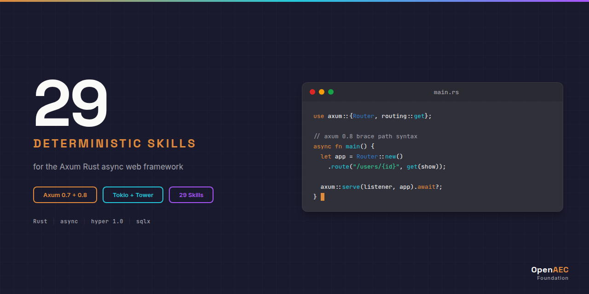

# Axum : Claude Skill Package

<p align="center">
  
</p>


**29 deterministic Claude skills for Axum, the Rust async web framework: routing, extractors, handlers, middleware, the tower stack, WebSockets, authentication, sqlx integration, error handling, and deployment. Covers Axum 0.7 and 0.8.**

Built on the [Agent Skills](https://agentskills.org) open standard. Discoverable via the npm-agentskills manifest and OpenAI Codex skill discovery.

## Why This Exists

Without skills, Claude lacks deterministic guidance for Axum patterns. Axum 0.8 changed the route-parameter syntax, and the old form does not warn, it panics at startup:

```rust
// Wrong : axum 0.7 path syntax on an axum 0.8 router panics at router construction
let app = Router::new().route("/users/:id", get(show_user));
```

With this skill package, Claude produces the correct, version-aware pattern:

```rust
// Correct : axum 0.8 brace syntax
let app = Router::new().route("/users/{id}", get(show_user));
// axum 0.7 used "/users/:id" ; the migration skill documents every breaking change
```

Every skill encodes this kind of deterministic, version-explicit knowledge: extractor
ordering rules, the "never block the Tokio runtime" rule, middleware ordering, the
infallible-handler error model, and more.

## What's Inside

| Category | Count | Purpose |
|----------|:-----:|---------|
| **core/** | 5 | Architecture, routing, state, performance, version migration |
| **syntax/** | 4 | Extractors, custom extractors, handlers, responses |
| **impl/** | 15 | Middleware, tower, WebSockets, SSE, auth, database, testing, deployment |
| **errors/** | 3 | Error handling, extractor rejections, the Handler trait error |
| **agents/** | 2 | Code review and service scaffolding orchestration |
| **Total** | **29** | |

See [INDEX.md](INDEX.md) for the complete skill catalog with descriptions and dependency order.

## Installation

### Claude Code (recommended)

```bash
git clone https://github.com/OpenAEC-Foundation/Axum-Claude-Skill-Package.git
cp -r Axum-Claude-Skill-Package/skills/source/ ~/.claude/skills/axum/
```

### As git submodule

```bash
git submodule add https://github.com/OpenAEC-Foundation/Axum-Claude-Skill-Package.git .claude/skills/axum
```

### Claude.ai (web)

Upload individual SKILL.md files as project knowledge.

## Skill Structure

Every skill follows 3-level progressive disclosure:

```
axum-{category}-{topic}/
├── SKILL.md              # Main guidance (< 500 lines)
└── references/
    ├── methods.md        # Complete API signatures
    ├── examples.md       # Working code examples
    └── anti-patterns.md  # What NOT to do (with explanations)
```

YAML frontmatter uses a folded scalar `>`, a "Use when..." opener, and a `Keywords:` line mixing technical, symptom-based, and plain-language terms for maximum discoverability.

## Quality Guarantees

- **Deterministic language** : ALWAYS / NEVER, no "you might consider"
- **Version-explicit code** : every example annotated for Axum 0.7 and 0.8
- **WebFetch-verified** : all code snippets validated against official docs (docs.rs, the tokio-rs/axum repository)
- **CI/CD validated** : frontmatter, line count, structure, language, em-dash checks on every push
- **Compliance audit** : 100% (4/4 checks), see [docs/validation/audit-report.md](docs/validation/audit-report.md)

## Companion Skills : Cross-Technology Integration

For projects combining Axum with other technologies, see [Cross-Tech-AEC-Claude-Skill-Package](https://github.com/OpenAEC-Foundation/Cross-Tech-AEC-Claude-Skill-Package). Axum pairs naturally with the Rust language fundamentals and with PostgreSQL or MariaDB via sqlx.

## Related Skill Packages (OpenAEC Foundation)

| Package | Skills | Repo |
|---------|--------|------|
| Blender-Bonsai-ifcOpenshell-Sverchok | 73 | [Link](https://github.com/OpenAEC-Foundation/Blender-Bonsai-ifcOpenshell-Sverchok-Claude-Skill-Package) |
| Frappe | 61 | [Link](https://github.com/OpenAEC-Foundation/Frappe_Claude_Skill_Package) |
| Tauri 2 | 27 | [Link](https://github.com/OpenAEC-Foundation/Tauri-2-Claude-Skill-Package) |
| Speckle | 25 | [Link](https://github.com/OpenAEC-Foundation/Speckle-Claude-Skill-Package) |

See the full list at [OpenAEC-Foundation](https://github.com/OpenAEC-Foundation).

## License

MIT : OpenAEC Foundation

## Contributing

See [CONTRIBUTING.md](CONTRIBUTING.md). Built with the [Skill Package Workflow Template](https://github.com/OpenAEC-Foundation/Skill-Package-Workflow-Template) methodology.
